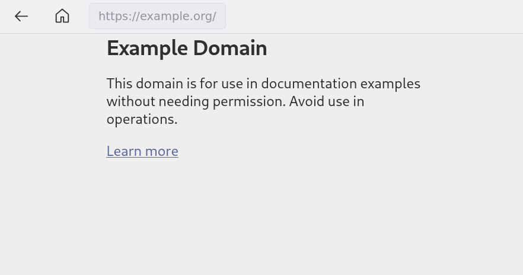

#  Firefox Kiosk Schischi

A Firefox extension that adds a minimal navigation toolbar (Back, Home) and kiosk
lockdown features to Firefox running in `--kiosk` mode.

Firefox's built-in `--kiosk` flag locks down the UI but removes all navigation controls.
This extension re-adds a compact top toolbar and provides additional lockdown hardening
for library kiosk deployments.



## Features

- **Back / Home buttons**, always visible and enabled
- **Read-only URL bar** showing the current page address
- **PDF support** — PDFs are displayed inside a wrapper page so the toolbar stays visible
  (Firefox blocks content script injection into its built-in PDF viewer)
- **Idle timeout** — navigates back to the home page after 5 minutes of inactivity
- **New-tab suppression** — links that try to open new tabs/windows are redirected into
  the current tab
- **Loading animation**
- **Keyboard shortcut blocking** — Ctrl+T, Ctrl+N, Ctrl+L, F12, etc. are suppressed
- **Right-click context menu suppressed**
- No user-configurable settings — home button always returns to the first URL the browser saw in this session (homepage preference only used if no usable URL has ever been visited)

## Recommended `policies.json`

Deploy the extension alongside a Firefox Enterprise Policy for a complete kiosk lockdown.

Policy file location (create the directory if it does not exist):

```text
/etc/firefox/policies/policies.json
```

```json
{
  "policies": {
    "BlockAboutConfig": true,
    "BlockAboutProfiles": true,
    "BlockAboutAddons": true,
    "DisableDeveloperTools": true,
    "DisableFirefoxAccounts": true,
    "DisableFormHistory": true,
    "DisablePrivateBrowsing": true,
    "DisableProfileImport": true,
    "DisableProfileRefresh": true,
    "DisableSafeMode": true,
    "DontCheckDefaultBrowser": true,
    "Homepage": {
      "URL": "https://your-catalog.example.com",
      "Locked": true,
      "StartPage": "homepage"
    },
    "InstallAddonsPermission": {
      "Default": false
    },
    "OverrideFirstRunPage": "",
    "OverridePostUpdatePage": "",
    "Preferences": {
      "browser.tabs.warnOnClose": {
        "Value": false,
        "Status": "locked"
      }
    },
    "ExtensionSettings": {
      "firefox-kiosk-schischi@csl.mpg.de": {
        "private_browsing": true,
        "installation_mode": "force_installed",
        "install_url": "https://firefox-kiosk-schischi-e944d5.pages.gwdg.de/firefox-kiosk-schischi.xpi"
      }
    }
  }
}
```

Verify the policy is active by opening `about:policies` in Firefox.

## Build

Requires [web-ext](https://github.com/mozilla/web-ext):

```bash
npm install
web-ext lint        # check for errors
web-ext build       # → web-ext-artifacts/firefox_kiosk_schischi-*.zip
```

...or just zip to an `foo.xpi` file.

## Development

Install dependencies once to activate Git hooks:

```bash
npm install
```

A pre-commit hook runs `npx web-ext lint` and blocks commits when lint fails.

### Test locally

```bash
npx web-ext run
```

## Usage

```bash
firefox-esr --kiosk https://your-catalog.example.com
```

## Architecture

```text
background.js          – Global home‑URL tracking, PDF interception, idle timeout,
                         new-tab suppression, message hub
shared/panel.js        – createKioskPanel(): Back + Home buttons, URL bar,
                         keyboard/context-menu lockdown, link-target rewriting
shared/panel.css       – Toolbar styling
content/content.js     – Bootstraps the panel on every web page
content/style.css      – Pushes page body down 40px for the toolbar
wrapper/wrapper.html   – Extension page for displaying PDFs with toolbar
wrapper/wrapper.js     – Retrieves captured PDF blob and displays in iframe
wrapper/wrapper.css    – PDF iframe positioning
```

Content scripts cannot inject into Firefox's built-in PDF viewer (`resource://pdf.js/`).
The extension intercepts PDF responses via `webRequest.filterResponseData`, captures the
bytes in memory, and redirects to a wrapper extension page that displays the PDF in an
iframe with the kiosk toolbar above it.

## CI/CD

GitHub Actions (`.github/workflows/ci.yml`) runs on every push and pull request:

- **lint** — validates the extension on every push/PR
- **build** — builds an unsigned `.xpi` (after lint)
- **sign-xpi** — signs and submits to AMO via `web-ext sign` (`main` branch only, skipped if the version in `manifest.json` hasn't changed)

The sign job requires two secrets in **Settings → Secrets and variables → Actions**:

| Secret | Description |
| --- | --- |
| `WEB_EXT_API_KEY` | JWT issuer from [addons.mozilla.org API credentials](https://addons.mozilla.org/developers/addon/api/key/) |
| `WEB_EXT_API_SECRET` | JWT secret from the same page |

Bump the version in `manifest.json` before merging to `main` to trigger a new AMO submission.
